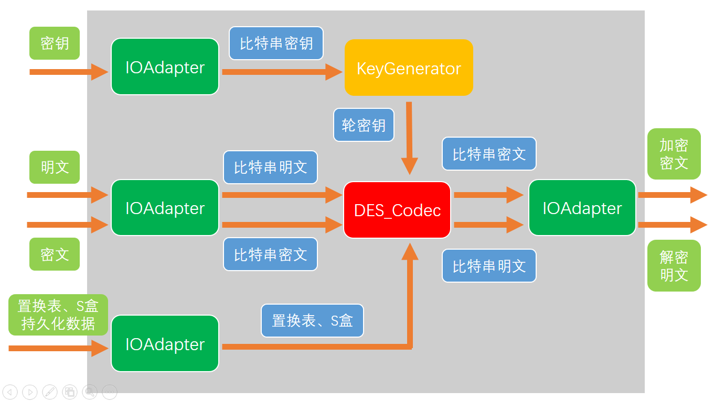

# DES加解密算法

DES加密解密算法的实现主要涉及 `IOAdapter`, `KeyGenerator`, `Des_code` 3个模块：

| 模块                       | 作用                                                         |
| -------------------------- | ------------------------------------------------------------ |
| IOAdapter（IO适配器）      | 1.从文本读取DES加密所需的置换表、S盒等数据 2.与外界IO输入输出流（如屏幕或磁盘文件）交互，转换数据格式      A.将**输入流数据**转换为比特串，输入DES编码解码器      B.将DES编码解码器输出的比特串转换为特定的**输出流数据** |
| KeyGenerator（密钥生成器） | 根据初始密钥，生成DES加密、解密所需的轮密钥                  |
| DES_Codec（编码解码器）    | 利用密钥生成器生成的轮密钥， 1.接收比特串明文，加密为比特串密文 2.接收比特串密文，加密为比特串明文 |

简略原理图如下所示：

使用C++编程语言实现DES算法（C++ 11），设计类图如下所示：

**实现细节：**

* 用 `bitset` 模板类存储比特串
* 用 `define` 关键字定义常量，用 `typedef` 关键字预先定义好DES加解密过程中的数据类型，提高代码可读性

**实现功能：**

- 对64位比特串组成的块进行加密、解密
- 对多个块（每个块是一个64位长的比特串）进行EBC模式加解密
- 对多个块（每个块是一个64位长的比特串）进行CBC模式加解密

**进一步提升（设想，未实现）：**

1. 用Unicode或base64等作为IO适配器的输入输出字符集，更适用于生活中的真实加解密场景。
2. 添加UI界面，封装成简单实用的桌面小工具——“DES编码解码器”。

